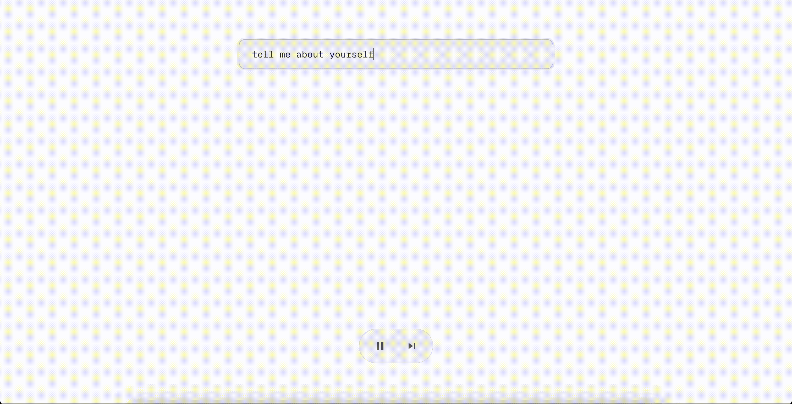

# Speculative

Visualized speculative decoding in the browser! Try it out here: https://speculative.vercel.app/.

### How it works

Speculative decoding is a technique to generate text from a target model by utilizing a faster draft model (see [Leviathan et al., 2023](https://arxiv.org/abs/2211.17192); [Chen et al., 2023](https://arxiv.org/abs/2302.01318)).

We've conceptually separated the process into three stages:

1. Drafting: the draft model generates up to a fixed number of tokens.
2. Verifying: the target model accepts or rejects the drafted tokens one by one.
3. Sampling: perform a final sampling step.

The models run in a separate JS worker thread and communicate with the React app via messages.

The demo uses `gemma-3-270m-it` as the draft model and `gemma-3-1b-it-ONNX-GQA` as the target model. Inference is done with [transformers.js](https://github.com/huggingface/transformers.js) on WebGPU.
